# OSB Controller

This branch contains a project that includes both hardware and software stacks for a gamepad based on the ESP32‑C3. The project was started out of a personal need for a button pad to control OBS while playing games.

The information and experience gathered from this project will be used for the following potential projects:
- Racing sim wheel
- Racing sim button stack
- Flight‑sim controls

## Hardware
I chose the ESP32‑C3 because I have a lot of them lying around. The goal is to build a fully functional Bluetooth gamepad.

### Design considerations
- The development board I have is the ESP32‑C3 Super Mini. Due to its size it only has 11 GPIO pins that can be used safely after removing two buttons (the Boot button and the LED). Eleven buttons will be more than enough for the initial version that controls OBS.
- The shell will be 3D‑printed.
- Mechanical keyboard switches will be used for the buttons.

### BOM
- [x] ESP32‑C3 Super Mini
- [x] Shell
- [x] Switches
- [x] Keycaps

#### ESP32‑C3 Gamepad
Although it is possible to have 11 buttons, I opted to use only 10 of them because that looks better. It may be possible to add more buttons, as there are additional GPIOs (GPIO8 and GPIO9) that are wired for other functions – the built‑in LED and the BOOT pin, respectively.

Ultimately, I have used GPIO0‑7, 10, and 20 for buttons 1‑10.

#### 3D prints
STL files can be found in the `hardware/3d-models` directory.

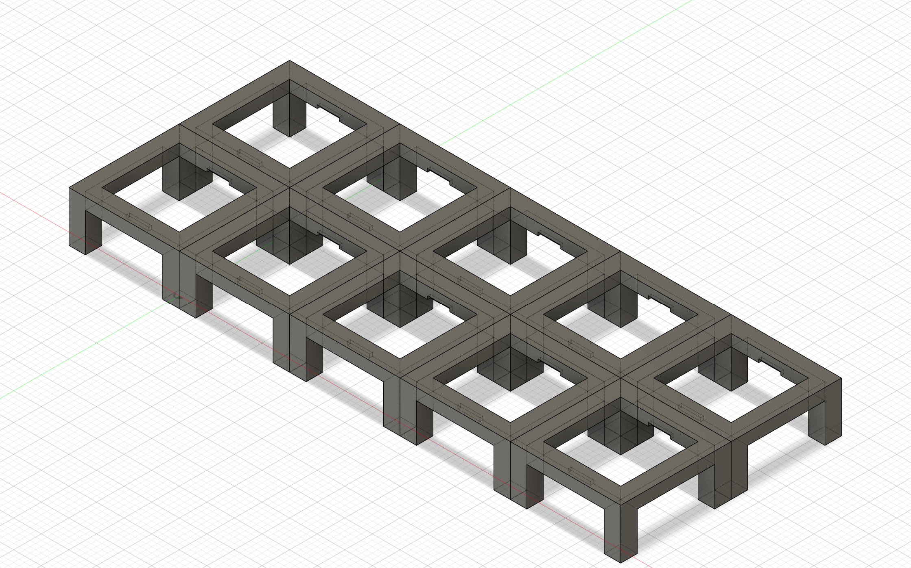
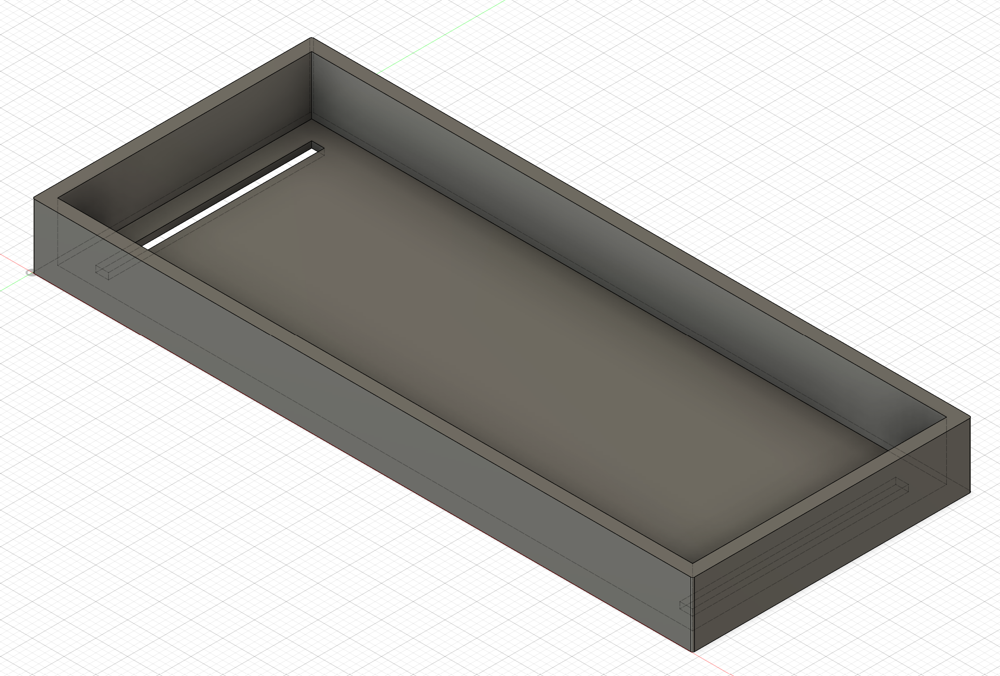
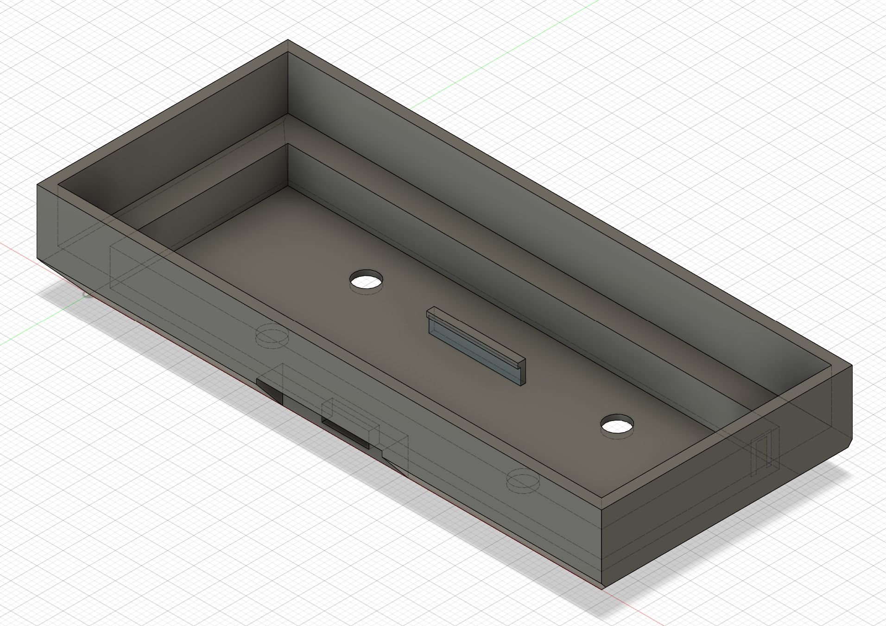
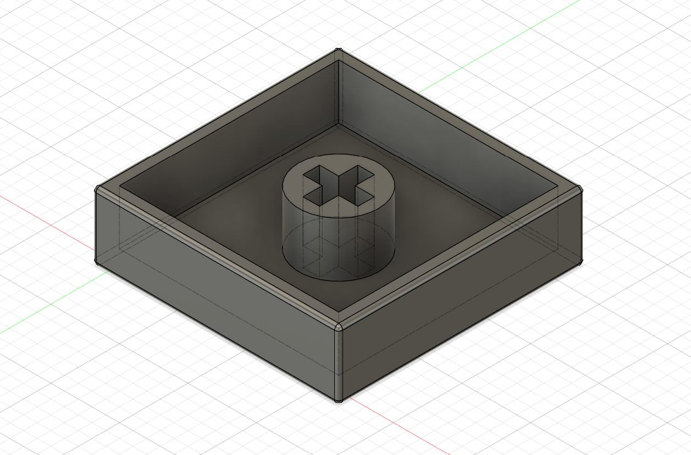

#### Assembly
I aimed to design a shell that is easy to assemble and disassemble because prototype devices typically require many iterations.

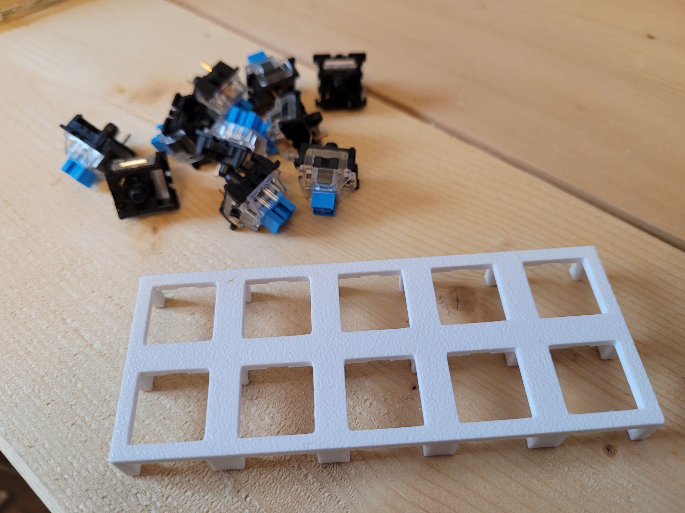
The first step was to create a grid that the switches could easily snap into. The dimensions are based on Cherry‑style switches with notches on the top and bottom sides to ensure a tight fit.

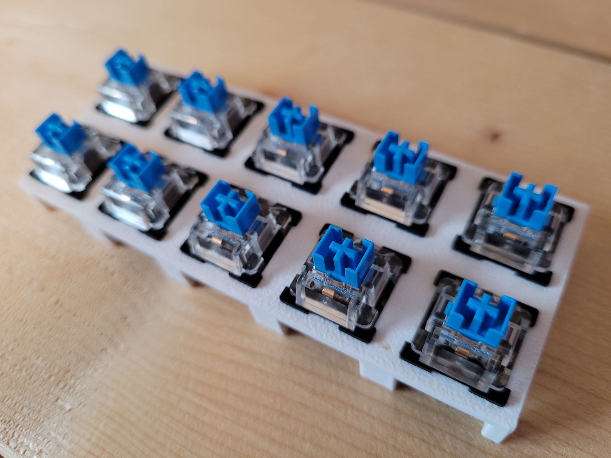
This is how it looks after all the buttons are installed.
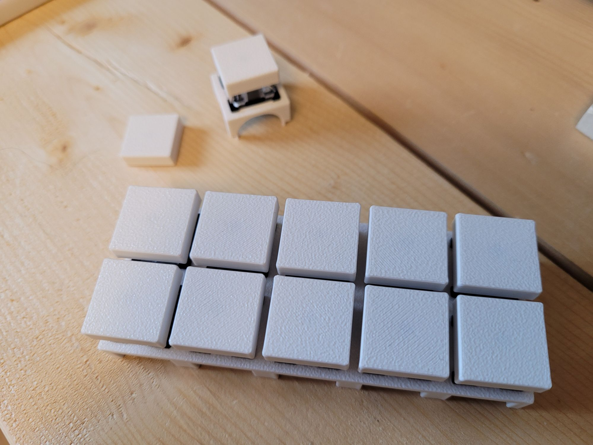
The button caps are flat; this is not a keyboard, so the slight concave shape common on keyboards is unnecessary.

I found that the switches have noticeable slack when I wiggle them. They were likely low‑quality units purchased cheaply from AliExpress – I don’t remember the exact model. They look aligned enough for me, but others may find this unacceptable.

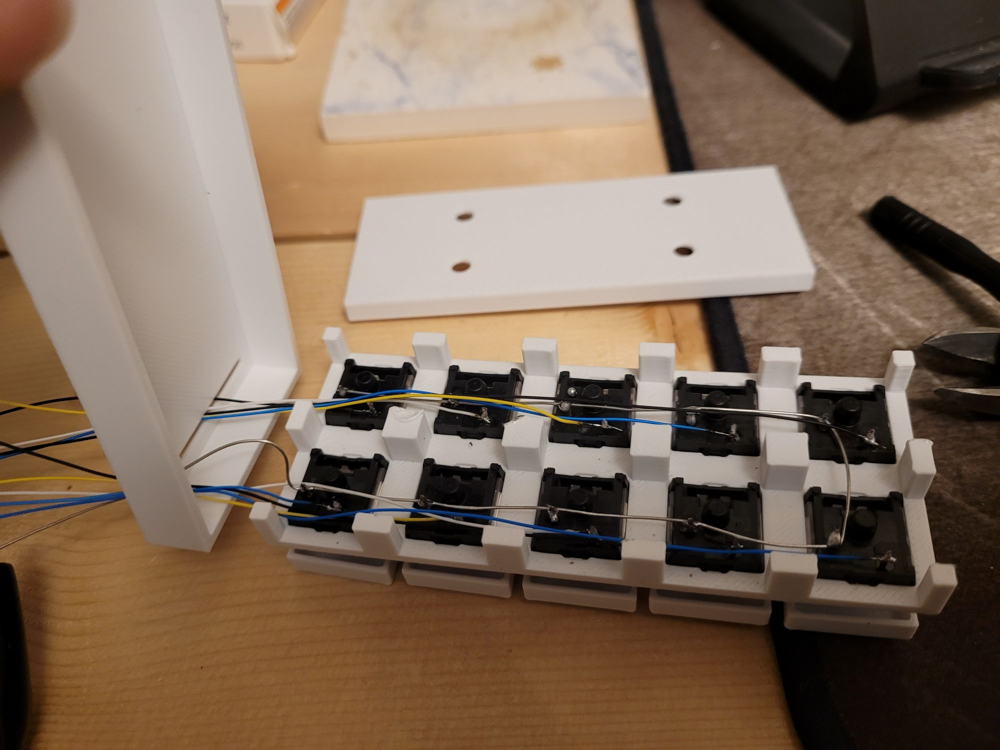

For Rev 1 I decided to solder all the buttons. Eventually I would like to design a PCB for it, but that is a future task.
If you look closely, there are two slots on the bottom cover for routing wires. Originally I added snap‑fit tabs on the mount to hold pieces together, but they were not strong enough for repeated assembly/disassembly cycles. After about ten failed prototypes I gave up on the idea of having tabs to hold the pieces together, which left me with two slots design instead of necessary single slot.

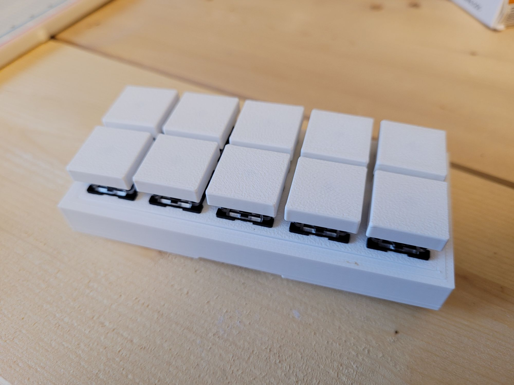
It is very easy to assemble this device: place the grid into the cover, then insert the whole cover‑plus‑grid assembly into the mount. The natural layer lines of the 3D prints create enough friction to hold the assembly tightly. One unexpected outcome is that disassembly can be quite hard because the friction is high; I could pry it apart with sufficient force, but I was not inclined to print another shell after more than ten failed prototypes to fix a minor inconvinence.

I was unable to photograph how the ESP32‑C3 Super Mini is mounted, so I used a photo of a failed prototype instead – the mounting concept is identical. When looking at the module, the USB port protrudes slightly from the PCB. Using this, I created a slot in the side of the mount to push the port into, and at an exact distance I added a wall with a slight tab at the top. Because PLA prints have enough flex, I could jam the module in with a bit of force. It fits tightly without issues so far, though stress over time may become a concern.

#### Arduino code
A single sketch for the ESP32‑C3 can be found [here](hardware/ble-gamepad/ble-gamepad.ino). The code is a slightly modified version of an example from the [NimBLE‑Arduino](https://github.com/h2zero/NimBLE-Arduino) library.

#### Simple tests
Even without a full software stack to use it as an OBS controller, this works as a perfectly good game controller. First, pair it via Bluetooth.

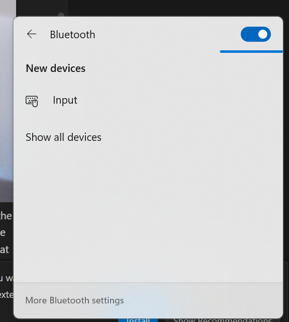
Before pairing
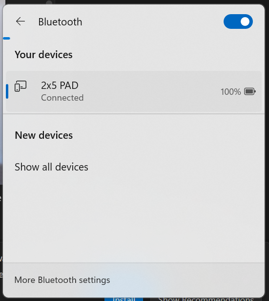
After pairing

The device appears as an input device, showing the name `2x5 PAD`. This name can be changed in the Arduino code.

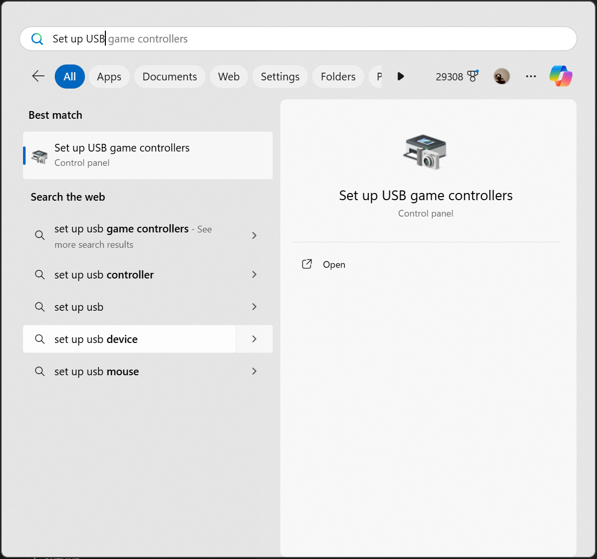
To test the gamepad, open the built‑in Windows “Game Controllers” app (search for it). The list shows all connected controllers. My own fight stick appears first; ignore that entry. The ESP32‑based controller shows up as `8 Axis 16 Button Device with Hat Switch`. This name seems random and I am not sure where it originates, but it does not affect functionality. It can be changed via the Registry Editor by finding all occurrences and replacing them.

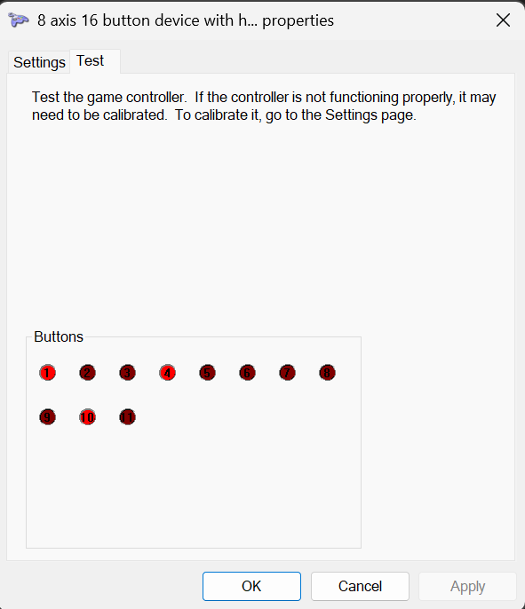
In the test dialog, the second tab displays the status of each control. Press the switches to see their corresponding circles light up. As mentioned earlier, the software reports 11 buttons to take advantage of all available pins, but only ten are wired so the product looks tidier. I plan to reuse the Arduino code in the future to support all 11 buttons.

## Software
There are several goals and requirements for this section:
- Controlling OBS using a gamepad
- The software will be built mostly using AI code agents (Vibe Coding)

### POC
The current software section has the POC code using C# and .Net 8. I have done some testing using another game controller that is not my own to understand how it must be coded. I was successful at changing the OBS scene using a button press.

The current code base has more code than what I have tested and may not work. There are still more to do to make it work with what I have. My inner software engineer made me to push it to be more generic than necessary... I do not know where I should stop. It is partially because of the fact that I am doing the coding mostly using AI, because it is too easy to keep going.

At this point, the software is functional to meet my own requeirments. You can see the details of the software in [software/README.md](./software/README.md) file.
